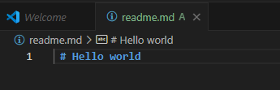
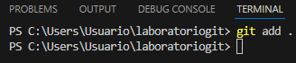
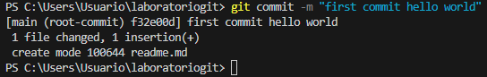
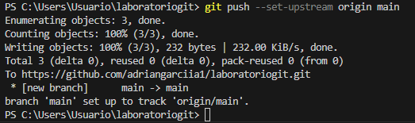
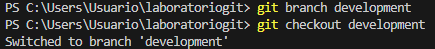
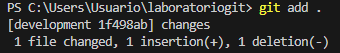
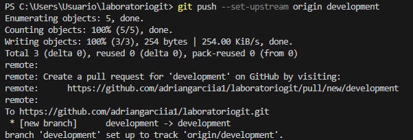
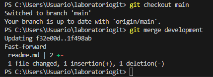
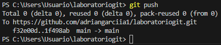

 # Laboratorio de Git
 ### Generamos un archivo
 
### Lo metemos en fase de stage
 
### Hacemos el primer commit
 
### Subimos los cambios al repositorio remoto
 
### Añado una rama y empiezo a trabajar en ella

### Lo metemos en la fase de staging y hacemos commit

### Actualizamos al repositorio remoto

### Cambiamos de rama y hacemos un merge con la rama development
 
### Hacemos el ultimo push
